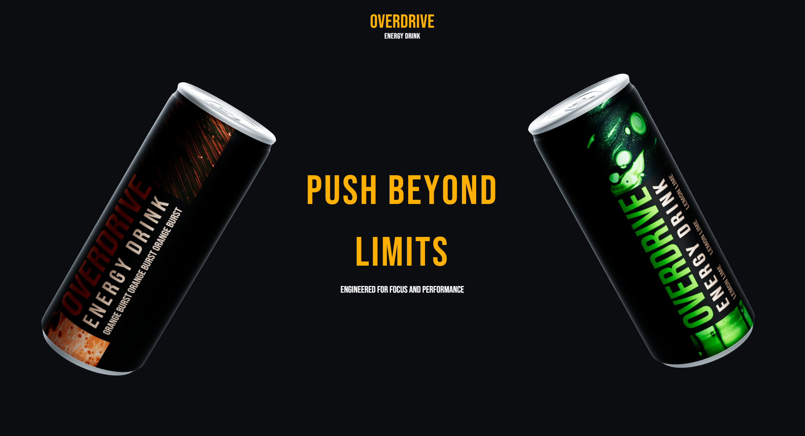

# Overdrive Energy ⚡

**3D Product Showcase – Desktop Experience**



👉 **Live demo:** https://overdrive-energy.netlify.app/

Overdrive Energy is an experimental **3D product showcase** built as a **desktop-only web experience**.  
The project combines **modern frontend technologies**, **scroll-driven animations**, and **real-time 3D rendering** to present a product in an immersive and interactive way.

The website was intentionally designed **for desktop devices only**. Layout, animations, and interactions are optimized for larger screens and stronger hardware to preserve performance, visual quality, and the intended user experience.

---

## ✨ Features

- 🧊 **Real-time interactive 3D models**
- 🎥 **Scroll-driven animations** synced with user interaction
- 🌀 **Smooth transitions and micro-interactions** powered by GSAP
- 🖥️ **Desktop-only experience** (intentional UX decision)
- 🎨 **Modern UI styling** using Tailwind CSS
- ⚡ High performance despite WebGL usage

---

## 🧠 Tech Stack

This project is built using a modern frontend stack:

### Core

- **Next.js 16** – App Router, client components
- **React 19**
- **TypeScript** – full type safety across the app

### 3D & Graphics

- **Three.js** – core 3D engine
- **@react-three/fiber** – React renderer for Three.js
- **@react-three/drei** – helpers for 3D scenes (Environment, View, etc.)

### Animations

- **GSAP** – advanced animation library
- **ScrollTrigger** – scroll-based animation control

### Styling

- **Tailwind CSS v4**
- **clsx** – conditional class handling
- **Prettier + Tailwind plugin** – consistent code formatting

### Tooling & Deployment

- **ESLint**
- **Prettier**
- **Netlify** – hosting and deployment

---

## 🧩 Architecture & Approach

- **3D canvas rendered only on desktop** (media queries + runtime checks)
- **Separate 3D scenes** for landing page and product pages
- **Scroll-controlled animations** instead of time-based timelines
- Conscious decision to **exclude mobile** for better UX and performance
- Minimal dependencies, focus on the core experience

---

## 🚀 Local Development

```bash
npm install
npm run dev
```
